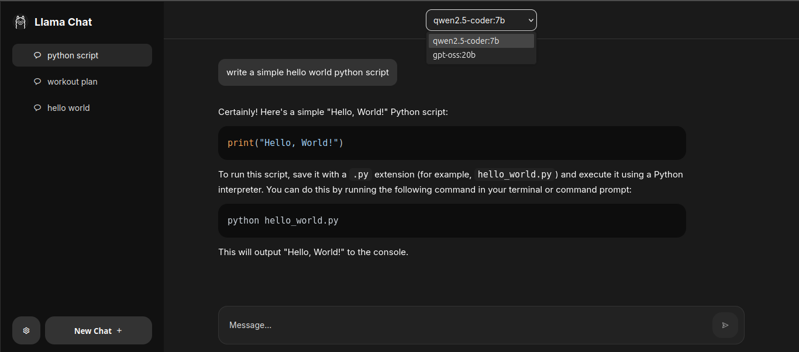
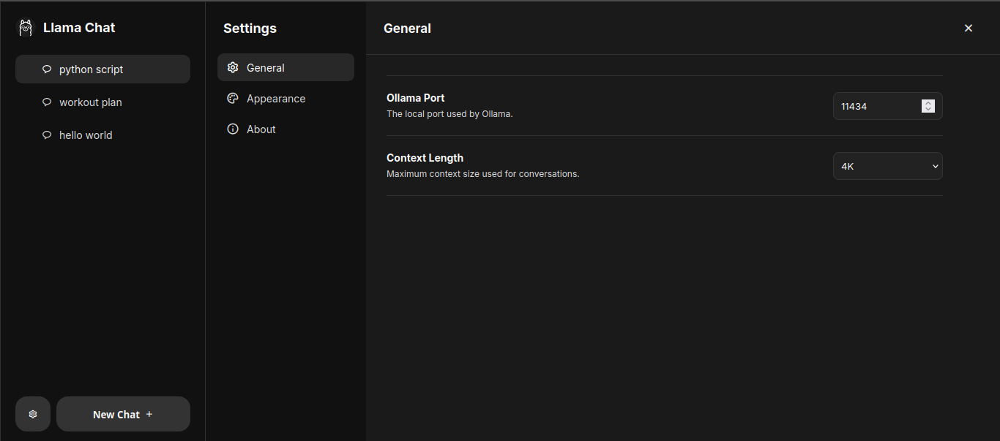

# Llama Chat

<p align="center">
  <strong>A clean, local-first AI chat application for Ollama.</strong>
</p>

<p align="center">
  Run local AI models, manage conversations, and chat through a simple ChatGPT-style interface — without sending your conversations to a cloud service.
</p>

<p align="center">
  
  
  
  
  
  
</p>

---

## Features

- 💬 **Local AI Chat** — Chat with locally running Ollama models with real-time streaming responses.
- 🗂️ **Chat Management** — Create, rename, select, and delete conversations with persistent chat history.
- ⚙️ **Customizable Settings** — Configure the Ollama port, context length, and choose between Dark, Light, or System themes.
- 📝 **Markdown Support** — Render Markdown and GitHub Flavored Markdown with syntax-highlighted code blocks.
- 🔒 **Local-First** — Keep your conversations and data on your own machine without relying on cloud AI services.
- 💻 **Clean Interface** — A simple, ChatGPT-style interface designed for a focused chat experience.

---

## Screenshots

#### Chat Interface



#### Settings



---

## Tech Stack

- **Next.js** — Application framework
- **React** — User interface
- **TypeScript** — Type-safe development
- **CSS Modules** — Component-level styling
- **Ollama** — Local AI model runtime
- **SurrealDB** — Local embedded database
- **pnpm** — Package management

---

## Requirements

Before running Llama Chat, make sure you have:

- **Node.js 20+**
- **pnpm**
- **Ollama**

You also need at least one model installed in Ollama.

For example:

```bash
ollama pull qwen2.5-coder:7b
```

You can use any Ollama-compatible model supported by your system.

---

## Installation
1. Clone the repository
`git clone https://github.com/iam-artax/LlamaChat.git`
`cd LlamaChat`
2. Install dependencies
`pnpm install`
3. Make sure Ollama is installed and running on your system.

The default Ollama address is:
http://localhost:11434

4. Start the development server
`pnpm dev`

Llama Chat will be available at:

http://localhost:3000

---

## License

Llama Chat is open-source software licensed under the MIT License.